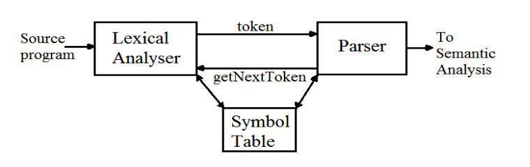

<h1> Compiler Design </h1>

- [compiler](#compiler)
- [interpreter](#interpreter)
- [structure of compiler](#structure-of-compiler)
- [Lexical analyzer](#lexical-analyzer)
- [Parser](#parser)
  - [top down parser](#top-down-parser)
  - [bottom up parser](#bottom-up-parser)
- [LL(1)](#ll1)

# compiler

- read a program in one language, source language
- and translate it into another language, target language

# interpreter

- directly executers the operations specified in the source file and on given data

# structure of compiler

- lexical analyzer
- syntax analyzer
- semantic analyzer
- intermediate code generation
- machine independent code optimizer
- code generator
- machine dependent code optimizer

# Lexical analyzer

# Parser

## top down parser

- generates parse tree for given input string with help of grammar productions by expanding non-terminals
- it start at start symbol and end at terminals
- uses left most derivation

 

- recursive decent parser - use backtracking
- non recursive decent parser - `LL(1)` - use parsing table (`first()`, `follow()`)

## bottom up parser

- generates the parse tree for given input string with help of grammar productions by compressing non-terminals
- starts on non-terminals and end at start symbol
- uses reverse of right most derivation

 

- LR - generates parse tree by using some unambiguous grammar.
- operator precedence parser - two consecutive non-terminals and epsilon never appear on right side of production

# LL(1)

## `first()`

$\text{first}(A)$ contains all terminals present in first place of every string derived by $A$

- $X \rightarrow abc$
  - $\text{first}(X) = \text{first}(a) = \{a\}$
- $X \rightarrow \epsilon$
  - $\text{first}(X) = \{\epsilon\}$
- $X \rightarrow A$, $A \rightarrow m$
  - $\text{first}(X) = \text{first}(A) = \{m\}$

## `follow()`

$\text{follow}(A)$ contains set of all terminals present immediate to right of $A$

- $\text{follow}(A)$ never contains $\epsilon$
- $\text{follow}(S) = \{\$\}$, follow of start symbol
- $X \rightarrow ABC$, 
  - $\text{follow}(B) = \text{first}(C)$
  - $\text{follow}(C) = \text{follow}(X)$

 

- $\text{follow}(S) = \{\$\}$, follow of start symbol
- $X \rightarrow \alpha B \beta$
  - $\text{follow}(B) = \text{first}(\beta)$
  - $\text{follow}(B) = \text{first}(\beta) - \{\epsilon\} \cup \text{follow}(\beta)$, 
    if $\epsilon \in \text{first}(\beta)$
- $X \rightarrow \alpha B$
  - $\text{follow}(B) = \text{follow}(X)$