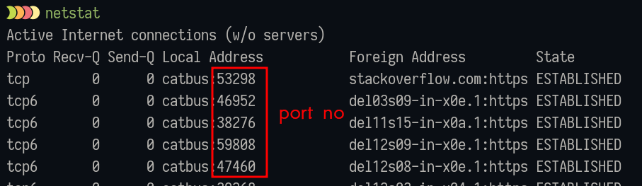

# Computer Network

- [Computer Network](#computer-network)
- [networking](#networking)
- [some terms](#some-terms)
	- [nic](#nic)
	- [topology it defines how the network is connected](#topology-it-defines-how-the-network-is-connected)
	- [hub (not used anymore)](#hub-not-used-anymore)
	- [switch](#switch)
	- [bridge](#bridge)
	- [router](#router)
	- [repeater](#repeater)
	- [modem](#modem)
- [osi model](#osi-model)
	- [layers](#layers)
	- [application](#application)
	- [presentation](#presentation)
	- [session](#session)
	- [transport](#transport)
	- [network](#network)
	- [data link](#data-link)
	- [physical](#physical)

# networking

- network - two or mote computers connected together
- networking - two or more computers share data in network

# some terms

## nic

- nic - network interface card
- on pc they are connected through pic
- every nic have a mac address
- my laptop have two mac address
  - one for the ethernet nic card
  - one for the wifi nic card
- dongels which are used to connect to internet through usb
  - they also have nic card embedded and also have mordem
- when we use internet through usb mobile it also have a nic
  - embedded to it so the mac address of the mobile will be used

## topology it defines how the network is connected

- bus topology
- star topology - this is most common now
- ring topology
- mesh topology

## hub (not used anymore)

- earlier when we used to connect multiple computers together
  we need more nic card, because one nic card can be used to 
  connect to another computer, but if a second computer comes in
  you have to purchase another nic card for it.
  so if network become large you cannot purchase that many cards
- hub broadcast the data
- hub shared bandwidth, i.e. if 8mbps internet speed is given to it
  it will distribute to all the devices, so suppose 4 devices are connected
	each will get 2mbps even when someone is not using it
- hub usually have 4 to 8 ports
- less no of ports

## switch

- more port - 24
- learns mac address and don't broadcast the data

**Note**
- Unicast - one to one, 
- Multicast - one to many,
- Broadcast - one to all

## bridge

- software based
- less ports compared to switch

## router

- does routing

## repeater

- amplify the signal
- after 100m ethernet used

## modem

- modulation - analog to digital
- demodulation - digital to analog

# osi model

- developed by iso
- dod - department of defense model, later renamed to `tcp/ip`
  - most used now
- osi - reference model, only rules and regulations
  - tcp/ip model - follow this
  - there are other models too,
- other network protocols are
  - netware - used by windows earlier, for file sharing
  - appletalk

## layers

**APSTNDP**

- application 
- presentation
- session
- transport
- network
- data link
- physical

**NOTE:**
- every layer have some PDU - protocol data unit
  which is the type of data present in that layer

## application

- software generate the data
- pdu - data

## presentation

- format of the data
- compression and decompression
- encrypt and decrypt data
- pdu - data

## session

- maintain the session via port numbers
- like same website on different tabs on browser
- or different application
- data will not get intermixed
- pdu - data

## transport

- end to end delivery of the data
- udp and tcp protocols are used
- flow control - don't send more data
- congestion control - too many packets in the network
- segmentation - dividing into packets
- error correction
- pdu - segment

## network

- ip address
- source and destination address headers are added
- routing is done
- ip, ipx protocol are used
- pdu - packets

## data link 

- source and destination mac address is added
- `FF:FF:FF:FF:FF:FF` broadcast mac address, or add mac address of the gateway
- they keep on changing when frame is passed between routers
- ip address in never changed
- pdu - frames

## physical

- connecters, cables, hub, work on this layer
- pdu - bit

# tcp/ip model

- application
  - OSI - application, presentation, session mix
- transport
  - OSI - transport 
- internet
  - OSI - network
- network access
  - OSI - data link, physical

## ports

- both udp and tcp have - (1-65535) number of ports, $2^{16} - 1 = 65535$
- because port no is a 18 bit number (2 byte)

 

- well known ports - 1 to 23
- registered ports - 1024 - 49151, assigned by IANA, internet assigned number authority
- dynamic ports, generated by pc, bound by the port you create on pc, rest of remaining ports
- use `netstat` on windows

### some common ports

#### tcp

- ftp - 21, file transfer protocol
- ssh - 22
- telnet - 23
- smtp - 25
- http - 80
- https - 443
- pop - 110
- dns - 53

#### udp

- tftp - 69, trivial ftp
- dhcp - 67/68
- smtp
- dns - 53