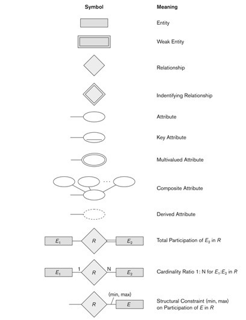
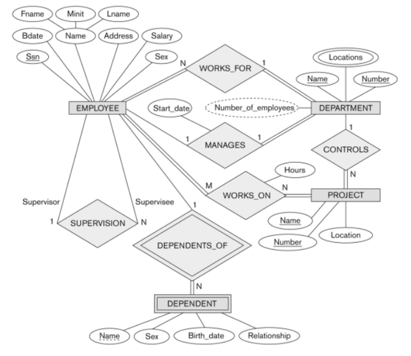

# Entity-Relationship model

## Entity, Entity type, Entity set,

- Entity
  - Any real world object.
  - A particular record in a RDBMS.
  - e.g. In student database student with a particular roll no. is an entity.

**Student Table**

| ID  | Name  | Enroll_No. | Email_id      |
| --- | ----- | ---------- | ------------- |
| 1   | reeee | 21         | dkj@gmail.com |
| 2   | seeee | 32         | jij@gmail.com |
| 3   | meeee | 20         | jei@gmail.com |
| 4   | reeee | 10         | eie@gmail.com |

- Entity
  - a particular record
  - e.g. `1`, `riya`, `21`, `dkj@gmail.com` is an entity.
- Entity Type
  - `Student` is the type of entity .
- Entity set
  - all the rows in a RDBMS is called entity set.

## Keys

- Candidate Key
  - can be a single column or combination of more than one column.
  - A minimal super key is called a candidate key.
  - For Person entity type `id`,`Enroll_No`, `Email_id`
- Primary Key
  - Each table has only a single primary key
  - `id` or `Enroll_No` or `Email_id` any one.
  - let `id` primary key
- Alternate Key
  - keys remain after choosing primary key
  - `email_id`, `Enroll_no`
- Super Key
  - `{id}`,
  - `{Enroll_No.}`, `{Email_id}`,
  - `{id, Enroll_No.}`, `{id, name}`, `{id, Email_id}`, `{name, Enroll_No.}`,
  - `{id, Enroll_No., name}`,
  - `{id, Enroll_No., Email_id}`, `{id, Enroll_No., name, Email_id}`
- Foreign key
- Compound key
- Composite Key
  - Primary key having two or more attributes.
  - Combination of two or more columns.
  - eg: `{id, Email_id}`
- Surrogate Key
  - A Surrogate Key’s only purpose is to be a unique identifier in a database,
  - for example, incremental key, GUID, etc.
  - Some other examples of a Surrogate Key
    - Counter can also be shown as Surrogate Key.
    - System date/time stamp
    - Random alphanumeric string.

## Relationship type and Relationship Set

- relationship type
  - represents the association between entity types.
    - `STUDENT --> ENROLS_IN-->COURSE`
    - `ENROLS_IN - relationship type`
- relationship set
  - set of relationship of same type

## Degree of a relationship

Number of participating entity type

- `binary relationship`- two entity type are participating in the relationship.
- `ternary relationship`- three entity types are participating in the
  relationship.

## Roles and Structural constraints

### Role Name

- Role that a participating entity form the entity type plays in each
  relationship instance
- `EMPLOYEE-->WORKS_FOR-->DEPARTMENT`
- `EMPLOYEE` entity type plays role of `employee` or `worker`.
- `DEPARTMENT` entity type plays role of `department` or `employer`.

### Recursive relation

- Same entity type participate more than once in a relationship type in
  different roles.
- `EMPLOYEE (supervisor)-->SUPERVISION-->EMPLOYEE (supervisee)`
- `EMPLOYEE` entity type participate twice in a `SUPERVISION`
  - once in a role of supervisor and
  - once in the role of supervisee

### Constraints on binary relationship type

`Constraints` - limit the possible combination of entities that may participate
in the corresponding relationship set.

### Types of constraints

- Cardinality ratio
- Participation

#### Cardinality ratio

- maximum no. of relationship instance that an entity can participate in .
- possible cardinality ratio
  1. `1 : 1` (one to one )
     - `EMPLOYEE (1)-->MANAGES-->DEPARTMENT (1)`
     - `DEPARTMENT : EMPLOYEE` is of cardinality ratio `1 : 1`
     - one department can be manage by one employee and one employee can manage
       one employee.
  2. `1 : N` (one to many)
     - `EMPLOYEE (N)-->WORKS_FOR-->DEPARTMENT (1)`
     - `DEPARTMENT : EMPLOYEE` is of cardinality ratio `1 : N`
     - each department can be related to any no. of employee but each employee
       related to one department only.
     - a department can have more than one employee
  3. `N : 1` (many to one)
  4. `M : N` (many to many)
     - `EMPLOYEE (M)-->WORKS_ON-->PROJECT(N)`
     - `PROJECT : EMPLOYEE` is of cardinality ratio `M : N`
     - an employee can work on several project and a project can have several
       employees.

#### Participation Constraints

- Minimum no. of relationship instances that each entity that each entity can
  participate in .
- also called _minimum cardinality constraint_.
- Two types
  - `Total participation` or existence dependency
    - every entity in the total set of employee entities must be related to
      department entity via `WORKS_FOR`.
    - represented using double line in ER diagram.
  - `Partial participation`
    - some or part of set of employees entities are related to department via
      `MANAGES`
    - every entity of employee entity types is not participating in
      `EMPLOYEE-->MANAGES-->DEPARTMENT`
    - represented by single line.

### Entity Types

#### Strong Entity Type

- Entity types that have a key attribute
- rectangular box

#### Weak Entity Type ( child entity type or subordinate entity type)

- Entity types that do not have key attribute of their own.
- represented by rectangle with double line.

#### Identifying or ( owner entity type or parent entity type or dominant entity type)

- identified by being related to specific entities from another entity type in
  combination with one of their attribute values.

`Identifying relationship `

- relationship that relates weak entity type to its owner
- represented by diamond with double line

`Partial key`

- weak entity type normally has a partial key or discriminator
- attribute that can uniquely identify weak entities that are related to same
  owner entity.

### Naming Convention

- Singular names for entity types.
- Entity type and relationship - capital letters
- Attribute names - initial letter capital
- Role name - lowercase letters

 { width=350px }

 { width=500px }
