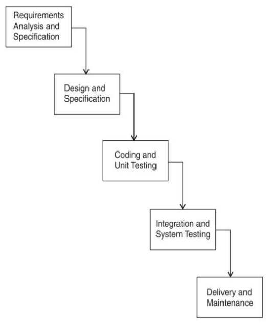

- software vs program
  - program is simple and usually a single source code file
  - software is a complex piece where more than one program are combined
- characteristics/features of a software
  - functionality - does it do what it was made for
  - reliability - how many times it break
  - usability - how much easier it is to use, learning curve
  - efficiency - how much resources it use
  - maintainability - how much it is easier to add feature of a fix
  - portability - can it run on multiple platforms
- software crisis
  - why it occurred?
    - increasing demand
    - increasing complexity
    - increasing challenges
    - same workforce
    - same methods
    - same tools
  - consequences?
    - project running over budget
    - project running over time
    - software very inefficient
    - projects were unmanageable and code difficult to maintain
    - software of low quality
    - the software often did not meet requirements
- types of software
  - system
  - application
  - scientific engineering
  - embedded
  - web 
  - ai
  - networking
  - business
  - entertainment
  - utility
  - document management
  - reservation

 

- software development life cycle
  - used by software industry to design, develop and test high quality software.
- models
  - code and fix
  - waterfall model
  - iterative waterfall model
  - V-model
  - evolutionary model
    - incremental implementation
    - prototyping
      - throwaway
      - evolutionary
  - spiral
  - software reuse
- comparing sdlc models
  - factors
    - shortfall - a measure how far the software is from meeting user requirements
    - lateness - time delay between appearance of new requirement and its fulfillment
    - adaptability - rate at which software can adapt to new requirements
    - longevity - time form system creation till its replacement
    - inappropriateness - measure of behavior of shortfall over time

 

- non traditional software development process
  - rapid application development (RAD)
    - business modeling
    - data modelling
    - process modelling
    - application generation
    - testing and turnover
  - rational unified process
    - inception
    - elaboration
    - construction
    - transition
  - agile development process
    - extreme programming (XP)
    - SCRUM

 

- requirements
  - types
    - system
    - user
    - functional 
    - non functional
      - product
      - organizational
      - external
- requirement engineering process
  - feasibility study
    - technical
    - operational
    - legal
    - schedule
  - requirement elicitation and analysis
    - process
      - requirement discovery
      - requirement classification and organization
      - requirement prioritization and negotiation
      - requirement specification
    - techniques
      - interviewing
      - observation
      - scenarios
      - use cases
      - questionnaires
      - survey
      - existing manual
      - group discussion
      - prototyping
      - brainstorming
  - requirement specification
    - how to write (specification)
      - natural language
      - structured
      - graphical notation
        - uml
      - mathematical
      - srs standards - ieee
        - good srs
          - correctness
          - completeness
          - consistency
          - concise
          - structured
          - unambiguous
          - verifiable
          - modifiable
          - traceable
          - testable
  - requirement verification and validation
    - validation checks
      - validity - 
      - consistency - requirements should not conflict
      - completeness 
      - realism - can sol. be implemented within time and available check
      - verifiability - can we write test to demonstrate that software meet srs
  - requirement management
- tools for requirement gathering
  - decision tables
    - condition entities
    - action entities
  - decision tree
  - data flow diagrams
    - made of
      - data flow - arrow
      - data transform or process - circle
      - data store - box open at one end
      - external entity - rectangle
    - level0
    - level1
    - level2
  - data dictionaries

 

- Software design
- activities
  - high level design 
  - detailed design
- good software design
  - correctness
  - understandability
  - efficiency
  - maintainability
  - completeness
  - consistency
- principles
  - problem partitioning
  - increasing abstraction
  - modularity
  - increase cohesion
  - reduce coupling
  - increase reusability
  - design for flexibility - should be flexible to anticipate changes
  - design for portability
  - design for testability
- level oriented software design
  - bottom up
  - top down
- function and object oriented software design
  - er model
  - decision tree
  - dfd
    - 0 level - context diagram
    - 1 level
    - 2 level
  - structure charts
- cohesion
  - coincidental - randomly put together
  - logical - similar functions
  - temporal - functions executed at same period
  - procedural - working for same algo and goal
  - communicational - all function refer to or update same data structure
  - sequential - elements are part of a sequence
  - functional - all elements work together to achieve a single task
- coupling
  - data - communicate through a parameter - int bool
  - stamp - through a c like structure
  - control - data from one is used to direct the order in another
  - common - global items
  - content - they share code
- functional independence
  - error isolation
  - scope of reuse
  - understandability

 

- object oriented design (ood)
  - class
  - abstraction
  - encapsulation
  - inheritance
  - polymorphism
- UML in ood
  - things - class, object, interface
  - relationships - 
  - diagrams
  - structural diagram - class diagrams show object classes and associations between them
  - interaction diagram - show interactions
  - behavioral diagrams - activity diagrams which show activities involved in process of data
- Context Models
- Interaction Models
  - use case diagram
  - sequence diagram
- Structured Models
  - class diagrams
- Behavioral Diagrams
  - data drive modelling
    - activity diagram
  - event driven modelling

 

- Architectural Design
- Architectural Views
  - logical view
  - process view
  - development view
  - physical view
- Architectural Patterns 
  - Layered
  - Repository
  - Client-server
  - Pipe-filter

 

- Development
  - Selection of a language
  - Reuse of the software
  - Configuration management
    - Version management
    - System integration
    - Problem tracking
  - Host target development
- Coding
- Coding guidelines
  - small and easy to understand
  - module - date of creation, who creates, use
  - naming convention
  - no goto
  - code documentation
- Coding Documentation
  - README
  - functionality of each module
  - naming conventions
  - name of contributors
  - license and version
- Code Review
  - code walkthrough
  - code inspection

## code and fix

### pros

- convenient for small projects
- time saver for low budget projects
- common in software groups where there are many entry level developers
- developers enjoy this model because of full control

### cons

- hard to maintain and change product
- quality related issues
- only for small projects
- hard to estimate end timeline

## waterfall

### pros

- simple easy to understand 
- phases processes one at a time
- suited for small project with well defined requirements
- all phases are well documented, if someone leave new employee will easily take their place
- enable project managers to track progress
- reduces development and maintenance cost

### cons

- rigid model. results of one phase has to be frozen before starting another phase
  in real life phases can overlap to reduce cost and increase efficiency
- not good for complex and long ongoing projects
- requirements change midway are difficult to accommodate
- no working model till end
- integration done at end, so hard to catch some issues
- heavily document to the point of being bureaucratic

## 

## 